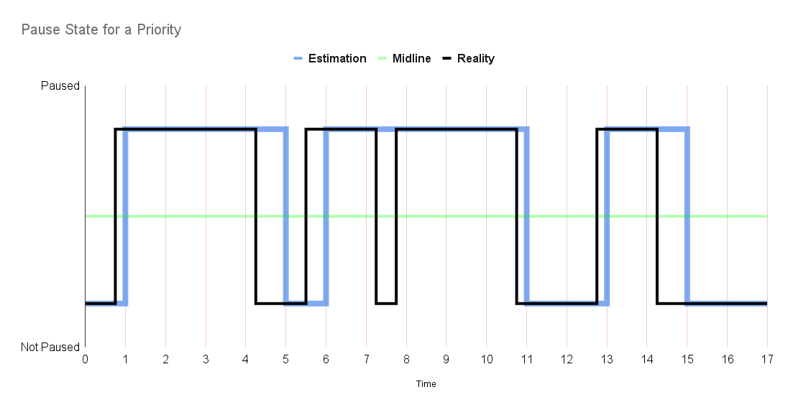
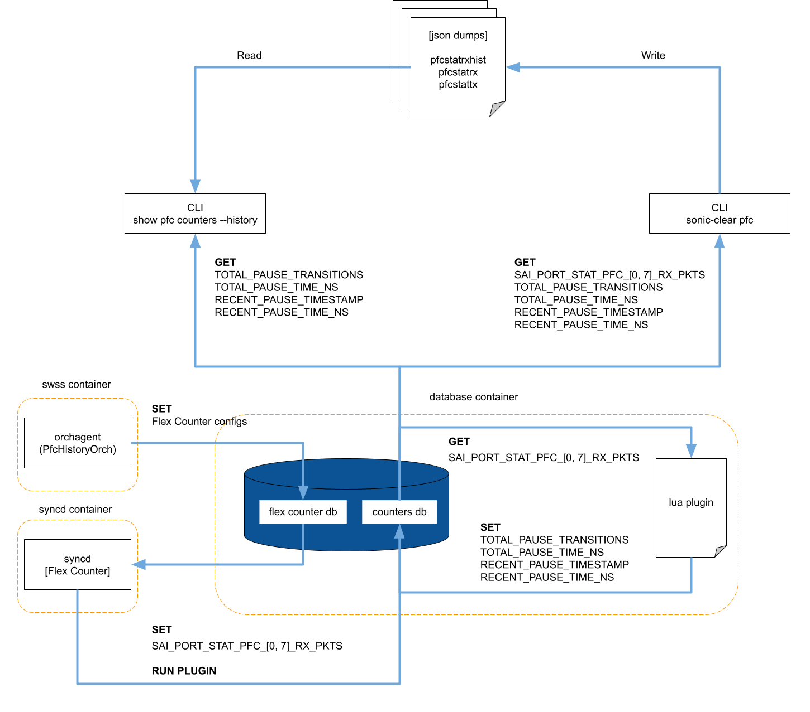
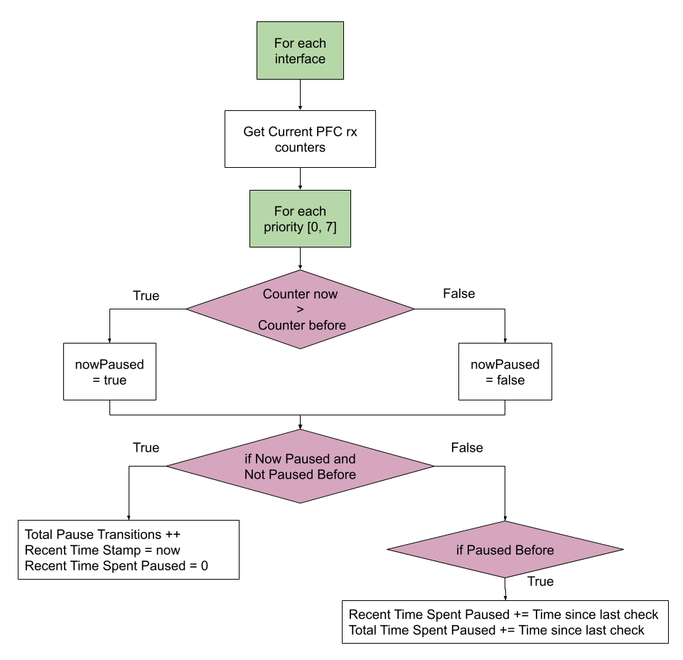

# PFC Historical Statistics

## Scope

This document describes the design of the PFC historical statistics feature and the usage of the added PFC counters history CLI to display the extrapolated historical data.

## Definitions/Abbreviations

| Term | Meaning |
| :---- | :---- |
| PFC | Priority Flow Control |
| SAI | Switch Abstraction Interface |
| RX | Receive |

## Overview

Approximate PFC historical statistics will be extrapolated by polling the existing PFC RX counters stored in COUNTERS\_DB. These counters will be used to infer whether each priority group is currently paused or not at time of polling.

These existing counters are incremented when pause frames are received at the granularity of priorities 0-7 for each configured interface on the switch. 

A new orch agent named "PfcHistoryOrch" will configure a flex counter group ("PFC\_STAT\_HISTORY") with a lua script plugin to poll COUNTERS\_DB at the configured interval and investigate if Pause Frames have been received on the interface.

`TOTAL_PAUSE_TRANSITIONS`: Running total number of transitions from unpaused to paused  
`TOTAL_PAUSE_TIME_MS`: Total time spent paused, in milliseconds  
`RECENT_PAUSE_TIMESTAMP`: Timestamp of the most recent transition from unpaused to paused, in milliseconds since Linux epoch  
`RECENT_PAUSE_TIME_MS`: Time spent paused after the most recent transition from unpaused to paused, in milliseconds

The plugin will use the existing RX counters to calculate values for these 4 new fields storing historical data in COUNTERS\_DB. These fields will exist for each priority (4 fields \* 8 priorities \= 32 new fields per interface)  
Note that in addition to those, 2\*8=16 meta data fields used by the script but not exposed on the CLI will also need to be stored..

These will only track the history of **received** pause frames and not those transmitted.

  

A simplified example of how this software estimation works for one priority queue can be seen above. The dark pulse shows a hypothetical scenario displaying the periods of time a priority is paused or unpaused. The blue pulse shows what we would estimate the wave to look like. The x-axis shows the time steps when the Flex Counter (run by syncd) polls COUNTERS\_DB.

The pulse transitions from ‘Not Paused’ to ‘Paused’ when a Pause Frame is received for this priority. The pulse remains paused for the period of time specified by that frame. Receiving the frame causes the RX counter to increment in hardware and this is exposed in a new PFC\_STAT\_HISTORY table in COUNTERS\_DB. A stream of frames must be sent for extended pause periods. Our assumption is that if the counter increments between polls then this queue is currently paused.

Between times 0 and 1 the queue transitions to being Paused. At time step 1 when COUNTERS\_DB is polled, the script will see that PFC activity has occurred since the last time and will assume the queue is now paused. Between times 1 and 2, 2 and 3, 3 and 4 a continuous flow of pause frames is being received so the script will correctly estimate that this queue is paused during that period. 

In this scenario the pause stream terminates before timestep 4 and the queue becomes unpaused between steps 4 and 5\. The script will see that no packets have arrived between 4 and 5 at which point it will consider the queue to no longer be paused.

This example also displays the common situation that will arise due based on the coarse granularity of the polling interval. Between timesteps 7 and 8 the queue unpauses but we will not know because frames were sent in that time period.

### Usage

This data will be accessible from the show CLI using `show pfc counters --history`.  
Additionally history will be cleared alongside the pfc counters when using the `sonic-clear pfc` command, meaning total time and total transitions will be set to 0 (through a diff with the saved cache, no writes to the database occur from the CLI). The recent time and timestamp will not be cached and therefore are not affected by sonic-clear.

## Architecture Design

  

### 

### sonic-swss

A new PfcHistoryOrch is used similarly to PfcWdOrch to start and configure the flex counters for this feature. On construction it loads the lua script and creates the Flex Counter Group for PFC\_STAT\_HISTORY. (i.e. inserts into FLEX\_COUNTER\_GROUP\_TABLE in FLEX\_COUNTER\_DB)

The orch subscribes to the PFC\_STAT\_HISTORY table in CONFIG\_DB. Entries in this table have a port key like so: PFC\_STAT\_HISTORY|Ethernet0, PFC\_STAT\_HISTORY|Ethernet240. The value associated with this entry is irrelevant, the PfcHistoryOrch will use the key to start or stop the flex counter for that interface regardless of the hash that is set. (i.e. inserts into FLEX\_COUNTER\_TABLE in FLEX\_COUNTER\_DB)

### sonic-sairedis

No changes, but syncd's flex counter mechanism runs the lua plugin. The lua script is passed the OID of all of the configured ports and works like so:  
  

* Every polling interval (default to 1 second), the lua script plugin will be run by syncd. The counters are updated in COUNTERS\_DB and the script is passed the list of port OIDs to check. The RX counter for each priority is read from COUNTERS\_DB to see if there has been PFC activity (i.e. check if the counter has increased since the last poll).   
* If there was activity for this priority, then we assume that this priority queue has been paused for the duration since the last check  
* Otherwise, we assume that the queue was not paused during that duration  
* COUNTERS\_DB has a new PFC\_STAT\_HISTORY table to store all the data for each interface between polls, including whether each priority is considered paused. This data is queried at each poll. Whether each queue is currently paused for each interface and uses this to determine if a new transition has occurred since the last check and also to create the timestamp for the startpoint of the most recent PFC activity.

### sonic-utilities

Addition of a \--history option to the show pfc counters CLI. The 4 new fields for each of the 8 priorities will be printed for each interface.   
`show pfc counters --history` will display the historical stats since the last clear  
`sonic-clear pfc` will now also cache the current total time and total number of transitions in the same way it did with the existing counters, meaning \--history will show the historical data since the last clear.

```
          Port    Priority    RX Pause Transitions    Total RX Pause Time MS    Recent RX Pause Time MS    Recent RX Pause Timestamp
--------------  ----------  ----------------------  ------------------------  -------------------------  ---------------------------
     Ethernet0        PFC0                      12                    12,000                      1,200         01/10/2008, 21:20:00
     Ethernet0        PFC1                      21                    20,001                      2,001         05/18/2033, 03:33:20
     Ethernet0        PFC2                      22                    20,002                      2,002         05/18/2033, 03:33:20
     Ethernet0        PFC3                      23                    20,003                      2,003         05/18/2033, 03:33:20
     Ethernet0        PFC4                      24                    20,004                      2,004         05/18/2033, 03:33:20
     Ethernet0        PFC5                      25                    20,005                      2,005         05/18/2033, 03:33:20
     Ethernet0        PFC6                      26                    20,006                      2,006         05/18/2033, 03:33:20
     Ethernet0        PFC7                      27                    20,007                      2,007         05/18/2033, 03:33:20

     Ethernet4        PFC0                      14                    14,000                      1,400         05/13/2014, 16:53:20
     Ethernet4        PFC1                      41                    40,001                      4,001         10/02/2096, 07:06:40
     Ethernet4        PFC2                      42                    40,002                      4,002         10/02/2096, 07:06:40
     Ethernet4        PFC3                      43                    40,003                      4,003         10/02/2096, 07:06:40
     Ethernet4        PFC4                      44                    40,004                      4,004         10/02/2096, 07:06:40
     Ethernet4        PFC5                      45                    40,005                      4,005         10/02/2096, 07:06:40
     Ethernet4        PFC6                      46                    40,006                      4,006         10/02/2096, 07:06:40
     Ethernet4        PFC7                      47                    40,007                      4,007         10/02/2096, 07:06:40

```

`show pfc counters` calls the `pfcstat.py` script under the hood. This is where all the major changes were actually made.   
The history option was built to work in conjunction with the existing options for pfcstat like so:

```
usage: pfcstat [-h] [-c] [-d] [-s SHOW] [-n NAMESPACE] [-v]
               [--history]

Display the pfc counters

options:
  -h, --help            show this help message and exit
  -c, --clear           Clear previous stats and save new ones
  -d, --delete          Delete saved stats
  -s SHOW, --show SHOW  Display all interfaces or only external interfaces
  -n NAMESPACE, --namespace NAMESPACE
                        Display interfaces for specific namespace
  -v, --version         show program's version number and exit
  --history             Display historical PFC statistics

Examples:
  pfcstat
  pfcstat -c
  pfcstat -d
  pfcstat -n asic1
  pfcstat -s all -n asic0
  pfcstat --history
  pfcstat -n asic1 --history
  pfcstat -s all -n asic0 --history
```

The default values for SHOW and NAMESPACE are to show all interfaces across all namespaces. Examples can be seen in the unit test cases in the Testing section below.

## High Level Design

* This is a built in SONiC feature  
* Sub-modules modified: `sonic-swss` and `sonic-utilities`  
* SWSS Changes:  
  * Added a new orch agent to load and configure new PFC STAT HISTORY Flex Counters  
  * New lua script plugin, loaded by PfcHistoryOrch and run on redis-db to poll counters and estimate PFC statistical history  
  * This agent was added as a makefile target and to OrchDaemon's orch list

### DB and Schema changes: 

#### `CONFIG_DB`: 

1) `FLEX_COUNTER_TABLE` gains a `PFC_STAT_HISTORY` entry  
* Configures the feature globally   
* Monitored by the FlexCounterOrch to configure the Flex Counters in syncd  
* Initially inserted by PfcHistoryOrch on creation

```javascript
"FLEX_COUNTER_TABLE": {
  "PFC_STAT_HISTORY": {
    "POLL_INTERVAL": "1000",
    "FLEX_COUNTER_STATUS": "disable"
  }
}
```

2) New `PFC_STAT_HISTORY` table similar to `PFCWD` table (`PFC_STAT_HISTORY|EthernetABC`)  
* These entries configure which ports will be monitored  
* Presence of a port in the table is what determines PFC history is enabled on that port, 'status' is a dummy value for informational purposes only  
* PfcHistoryOrch monitors this table to configure the Flex Counters in syncd  
* Entries are inserted using the new config cli addition, as described in Configuration and Management below


```javascript
"PFC_STAT_HISTORY": {
  "Ethernet176": {
    "status": "enabled"
  },	
  "Ethernet180": {
    "status": "enabled"
  }
}


```

#### `FLEX_COUNTER_DB`:

1) `FLEX_COUNTER_GROUP_TABLE` gains a `PFC_STAT_HISTORY` entry  
* FlexCounterOrch monitors the FLEX\_COUNTER\_TABLE in config\_db and configures the corresponding Flex Counter Group accordingly  
* Those changes are reflected here

```
FLEX_COUNTER_GROUP_TABLE: {
  PFC_STAT_HISTORY: {
    'POLL_INTERVAL': '1000',
    'STATS_MODE': 'STATS_MODE_READ',
    'PORT_PLUGIN_LIST': '2a32c1962cf0482238f09a1f138ce28b32e639b0',
    'FLEX_COUNTER_STATUS': 'enable'
  }
}
```

2) `FLEX_COUNTER_TABLE` gains `PFC_STAT_HISTORY:oid:<oid>` entries  
* These are inserted by the PfcHistoryOrch using the sairedis api to create flex counters.  
* Each entry looks like:  
  * {"PORT\_COUNTER\_ID\_LIST" : 	"SAI\_PORT\_STAT\_PFC\_\[0,7\]\_RX\_PKTS" }   
  * The key corresponds to the SAI object type of the \<oid\> (Ports in this case)  
  * The value is a list of the SAI counters to be read from the platform and written into COUNTERS\_DB

```
FLEX_COUNTER_TABLE: {
  PFC_STAT_HISTORY: {
    oid:0x1000000000041: {
      "PORT_COUNTER_ID_LIST" : [
        SAI_PORT_STAT_PFC_0_RX_PKTS,
        SAI_PORT_STAT_PFC_1_RX_PKTS
        ...
      ]
    },
    oid:0x1000000000030 : {...}
    ...
  }
}
```

#### `COUNTERS_DB`: 

New `PFC_STAT_HISTORY` table similar to `COUNTERS` table (`PFC_STAT_HISTORY:oid:<oid>`)

* Entries are populated by the lua script and displayed by the `show pfc counters --history` cli.  
* `PREV_RX_PKTS_[0, 7]` and `PAUSE_[0, 7]` are meta-data fields used by the plugin to compute the other four fields.

```
PFC_STAT_HISTORY: {
  oid:0x1000000000041: {
    TOTAL_PAUSE_TRANSITIONS_[0, 7]: 0,
    TOTAL_PAUSE_TIME_MS_[0, 7]: 0,
    RECENT_PAUSE_TIMESTAMP_[0, 7]: 0,
    RECENT_PAUSE_TIME_MS_[0, 7]: 0,
    PREV_RX_PKTS_[0, 7]: 0,
    PAUSE_[0, 7]: false
  },
  oid:0x1000000000030 : {...}
    ...
}
```

## SAI API

No changes made. 

However, some hardware has the capability to track this PFC historical data. In the future, SAI changes to expose this data can be made in place of the software estimation and the CLI will continue to be functional.

## Configuration and Management

### CLI/YANG model Enhancements

PFC Statistical History is enabled and disabled in a similar manner to the PFC Watchdog.  
`config pfc-stat-history status <enable|disable>`  
`config pfc-stat-history start <ports|all>`  
`config pfc-stat-history stop <ports|all>`  
`config pfc-stat-history interval <milliseconds>`

This entails YANG model additions for CONFIG\_DB. A new PFC\_STAT\_HISTORY table is used similarly to PFCWD 

The current status and ports enabled can be seen with   
`show pfc-stat-history config`

```c
Namespace: asic0
Setting              Value
-------------------  -------
POLL_INTERVAL        1000
FLEX_COUNTER_STATUS  disable

PFC Stat History enabled on:
Ethernet-BP4

Namespace: asic1
Setting              Value
-------------------  -------
POLL_INTERVAL        1000
FLEX_COUNTER_STATUS  disable

PFC Stat History not enabled on any ports
```

## CPU & Memory Consumption

No analysis performed.

## Testing

### Unit Test cases

Test cases involve running the following sequences of commands and matching the output against the expected output based on the mock counters\_db.json files.

* Single ASIC test cases:  
  * show pfc counters \--history  
  * sonic-clear pfc  
    show pfc counters \--history  
  * pfcstat \-c  
    pfcstat \-s all \--history  
* Multi ASIC test cases:  
  * show pfc counters \--history  
  * sonic-clear pfc  
    show pfc counters \--history  
  * pfcstat \-s frontend \--history  
  * pfcstat \-n asic0 \--history  
  * pfcstat \-n asic0 \-s all \--history  
  * pfcstat \-c  
    pfcstat \-s all \--history